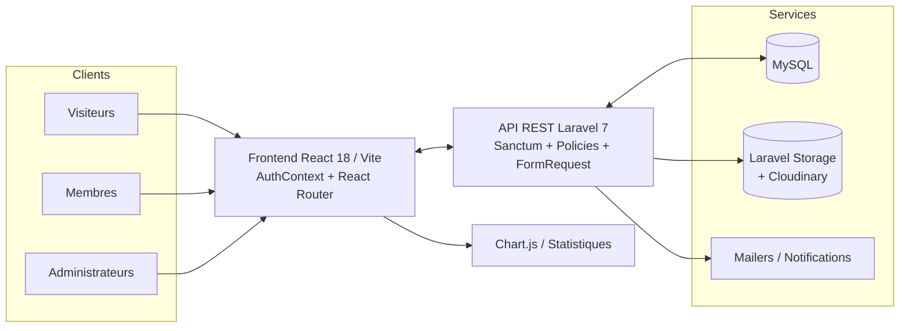
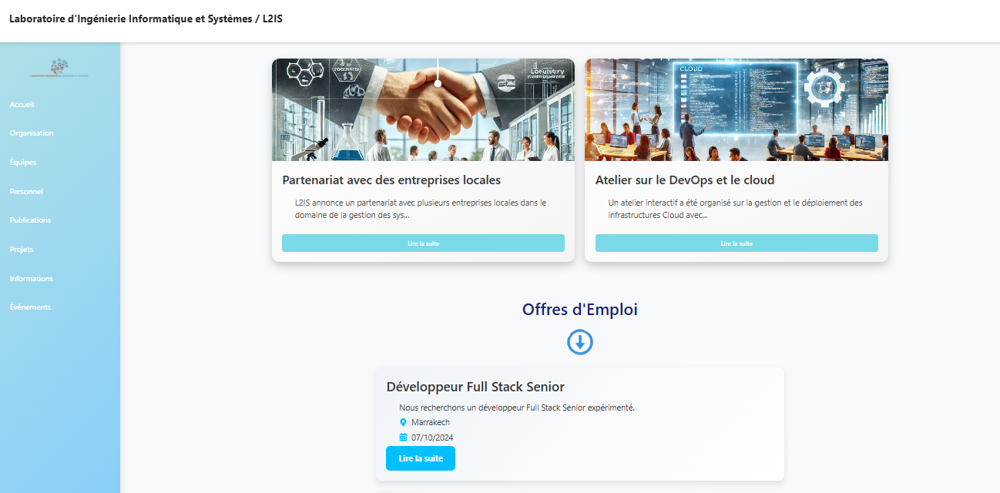
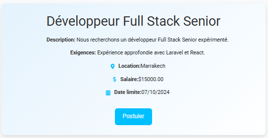
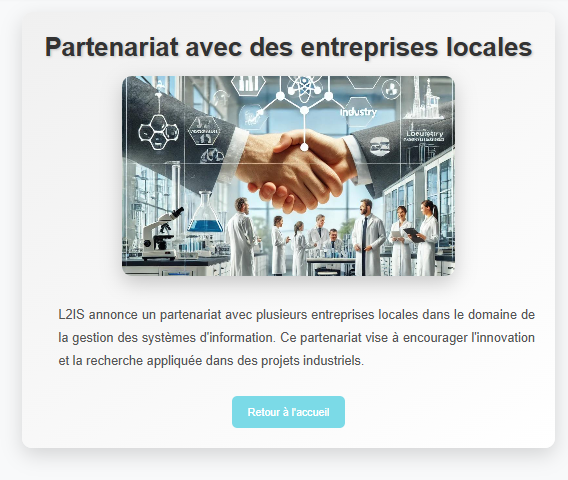
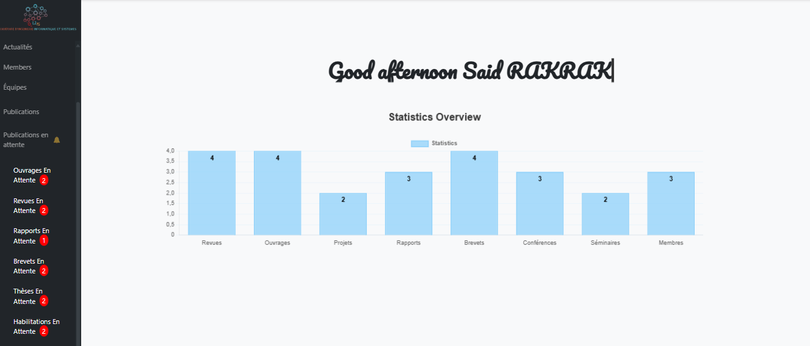
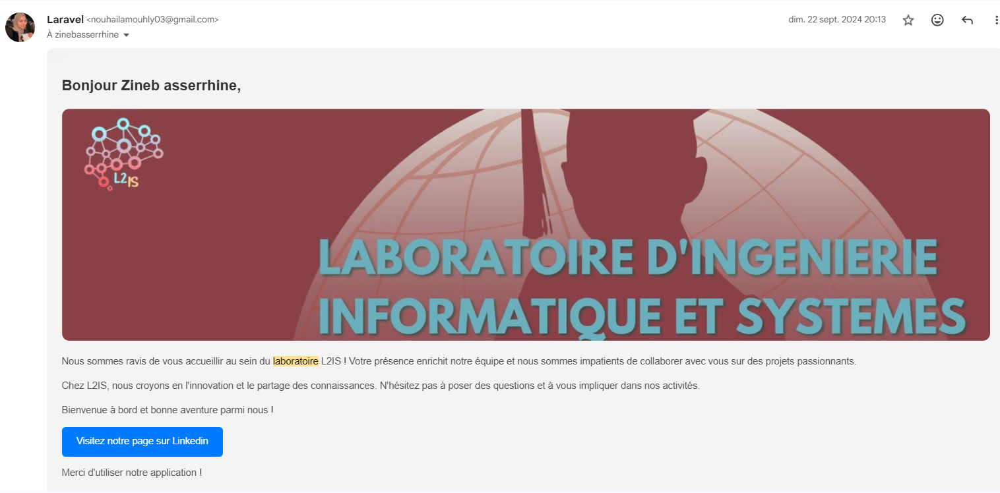
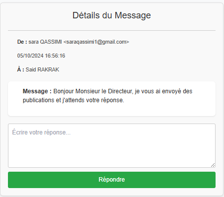

# Laboratoire L2IS · Plateforme de gestion de laboratoire

Laboratoire L2IS est une plateforme web complète destinée aux laboratoires de recherche : elle centralise la gestion des équipes, des axes scientifiques, des productions scientifiques (ouvrages, revues, brevets, rapports, thèses, habilitations), des événements (séminaires, conférences), des offres d’emploi et de la communication interne/externe.  
Le projet est découpé en deux applications : un backend **Laravel 7 + Sanctum** et un frontend **React 18 + Vite**.  
Référence du dépôt : [Nmouhly/Laboratoire_L2IS](https://github.com/Nmouhly/Laboratoire_L2IS.git).

---

## Valeur ajoutée & positionnement

- **Digitalisation des processus** : remplace les tableurs et échanges e-mail par des workflows structurés pour les publications, les recrutements et les événements.
- **Autonomie des chercheurs** : chaque membre peut soumettre, éditer et suivre ses contributions (ouvrages, brevets, thèses, habilitations, conférences).
- **Gouvernance et validation** : l’équipe admin dispose d’une console unifiée pour approuver/rejeter les contenus et piloter les annonces.
- **Exposition publique** : un site vitrine offre aux visiteurs un accès filtré aux projets, actualités, équipes et statistiques clés du laboratoire.
- **Scalabilité** : séparation front/back, API REST, authentification token via Sanctum, Cloudinary pour la gestion média.

---

## Architecture technique

| Couche | Technologies | Rôle principal |
| --- | --- | --- |
| Frontend | React 18, Vite, React Router, Axios, Tailwind, Bootstrap, Chart.js, CKEditor/TinyMCE | SPA pour la partie publique, les portails membres et le back-office. |
| Backend | Laravel 7, Sanctum, Cloudinary Laravel SDK, MySQL | API RESTful, gestion des rôles, modération, stockage sécurisé des données. |
| Authentification | Sanctum + stockage sécurisé du token côté client | Sessions stateless pour SPA, middlewares `auth:sanctum`, `ApiAdminMiddleware`, `ApiUserMiddleware`. |
| Média & Assets | Cloudinary, Storage Laravel (public disk) | Uploads de photos membres, visuels d’événements, pièces jointes. |
| Communications | Laravel Mail, Messagerie interne (API) | E-mails transactionnels (bienvenue, notifications), système de messagerie interne avec Inbox/Outbox. |

L’API expose plus de 80 routes (voir `backend/routes/api.php`) couvrant toutes les entités métier : utilisateurs, membres, axes, publications, événements, offres, messages, statistiques, etc.

---

## Diagramme d’architecture




---

## Captures d’écran clés

| Vue | Aperçu |
| --- | --- |
| Page d’accueil – présentation du laboratoire |  |
| Page d’accueil – actualités & offres |  |
| Carte « Développeur Full Stack Senior » |  |
| Détail d’une actualité |  |
| Dashboard admin – statistiques & publications en attente |  |
| E-mail de bienvenue – notification d’inscription |  |
| Messagerie interne – détail d’un message |  |


---

## Modules fonctionnels clés

- **Gestion des membres & équipes**
  - Création/édition des fiches membres, rattachement aux équipes/axes, vue publique détaillée (`/member/:id`).
  - Pilotage des organigrammes et présentations d’équipe.
- **Production scientifique**
  - Flux complets pour ouvrages, revues, brevets, rapports, thèses, habilitations.
  - Contrôle de doublons via vérification de DOI, workflow d’acceptation/rejet admin.
- **Événements & communications**
  - Séminaires, conférences, présentations, actualités, statistiques.
  - Pages publiques thématiques (`/evenements`, `/seminar`, `/conferences`, etc.).
- **Opportunités & carrières**
  - Publication d’offres d’emploi, détail accessible aux visiteurs, formulaires admin pour CRUD.
- **Messagerie interne & notifications**
  - Système de messagerie interne complet : Inbox/Outbox, marquage lu/non lu, réponse directe depuis l'interface (`MessageController`).
  - Envoi d'e-mails transactionnels (bienvenue, notifications de validation/rejet) via Laravel Mail avec templates personnalisés.
  - Visibilité filtrée par rôle et gestion des conversations entre membres et administrateurs.
- **Portails dédiés**
  - **Public** : site vitrine responsive (pages `Home`, `Equipes`, `Publications`, etc.).
  - **Membre** : espace personnel (`/user/*`) pour gérer profil et soumissions.
  - **Admin** : dashboard (`/dashboard/*`) regroupant monitoring et modération.

---

## Entités principales

| Domaine | Tables/Modèles Laravel | Description |
| --- | --- | --- |
| Personnes | `User`, `Member`, `Team`, `Axe`, `HomeDescription` | Gestion des comptes, rôles, rattachements et contenus éditoriaux. |
| Publications | `Ouvrage`, `Revue`, `Brevet`, `Report`, `These`, `Habilitation`, `Patent`, `Presentation` | Chaque entité dispose de CRUD public/membre/admin et d’un état (soumis, en attente, accepté). |
| Événements | `Seminar`, `Conference`, `Project`, `JobOffer` | Planification, statut (en cours/terminé), exposition sur le site public. |
| Communication | `News`, `Message`, `Statistics` | Actualités, messagerie interne, indicateurs pour le dashboard. |

---

## Aperçu des flux API

```api
/user/login              → Authentification (JSON token)
/user/logout             → Révocation du token
/members, /members/{id}  → Listing + profil public
/projects(/ongoing)      → Suivi des projets
/revues, /ouvrages ...   → Publications publiques
/messages/*              → Inbox/outbox membres authentifiés
/admin/dashboard         → KPIs consolidés pour l’équipe dirigeante
```

La majorité des opérations critiques (validation de publication, gestion d’équipe, suppression de contenu) est protégée par des middlewares admin.

---

## Mise en place locale

### 1. Backend (Laravel)

```bash
cd backend
cp .env.example .env  # renseigner DB_HOST, DB_DATABASE, Cloudinary, MAIL_*
composer install
php artisan key:generate
php artisan migrate --seed
php artisan storage:link   # exposition des médias publics
php artisan serve
```

### 2. Frontend (React)

```bash
cd frontend
npm install
npm run dev        # démarre Vite sur http://localhost:5173
```

Configurer `frontend/src/helpers/config.js` pour pointer vers l’URL du backend (`BASE_URL`). Les tokens Sanctum sont stockés dans `localStorage` (`currentToken`) et injectés via un `AuthContext`.

---

## Qualité, tests & observabilité

- **Tests** : gabarits fournis (`backend/tests/Feature`, `backend/tests/Unit`). Étendre avec des scénarios critiques (soumission publication, acceptation admin, messagerie).
- **Validation** : `FormRequest` dédiées (`AuthUserRequest`, `NewsStoreRequest`, etc.) pour normaliser et sécuriser les payloads.
- **Logs & monitoring** : intégration Laravel basique (monolog) + Cloudinary pour tracer les uploads.
- **Static analysis** : ESLint côté frontend (`npm run lint`), PSR-12 côté backend possible via PHP-CS-Fixer.

---

## Pistes d’amélioration

- Automatiser les tests d’intégration (Pest/Laravel Dusk) pour les workflows critiques.
- CI simple (GitHub Actions) : lint + tests + build.
- Internationalisation (i18n) du frontend (FR/EN).
- Export de données (CSV/PDF) pour les rapports annuels.

---

## Pourquoi ce projet met en valeur mon profil

- **Vision Produit & Fonctionnelle** : J’ai transformé des besoins métiers d’un laboratoire de recherche en modules cohérents et structurés (publications, événements, carrières, communication).
- **Stack Moderne Full JS/PHP** : Maîtrise de **React 18 + Vite** côté UI, **Laravel 7 + Sanctum** côté API, et **Cloudinary** pour la gestion média évolutive.
- **Qualité et Sécurité (Gouvernance)** : Implémentation de la **séparation des rôles** (visiteur, membre, admin), d'une **validation stricte** (vérification de DOI) et des mécanismes d'uploads sécurisés.
- **Workflows et Communications** : J'ai développé un **système de messagerie interne** complet (Inbox/Outbox avec interface de réponse intégrée) ainsi que des **flux d'e-mails transactionnels** (Laravel Mail) pour les notifications d'inscription, de validation/rejet de publications, et la gestion des cycles de vie critiques. Ces fonctionnalités améliorent la collaboration et la traçabilité des échanges.
- **Expérience Utilisateur Multi-rôles** : Conception et développement de **trois expériences sur mesure** (public, membre, admin) partageant et optimisant une base de code mutualisée.